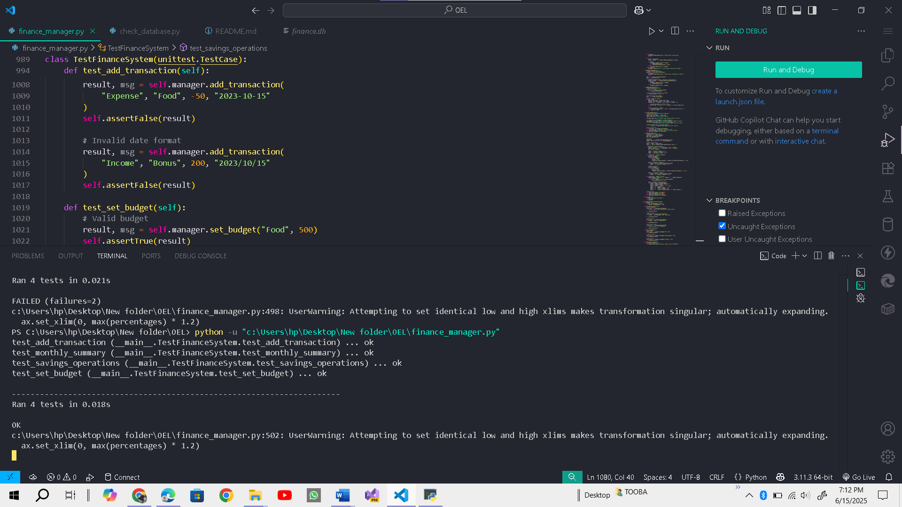
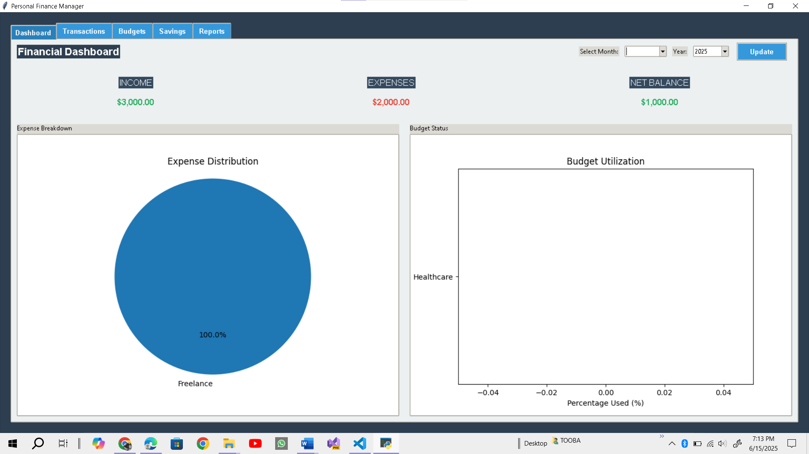
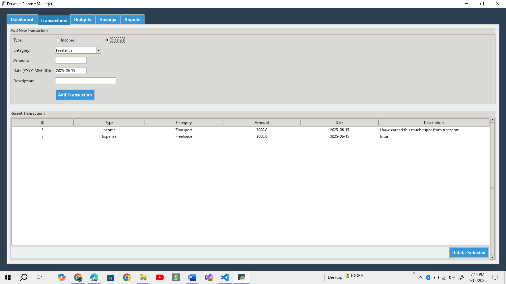
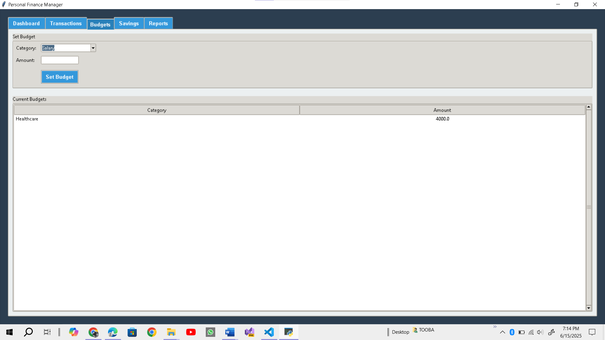
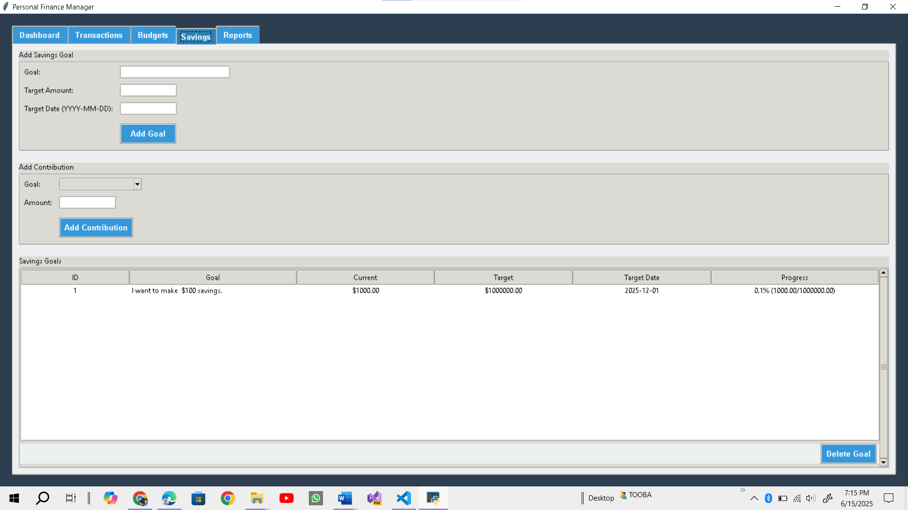
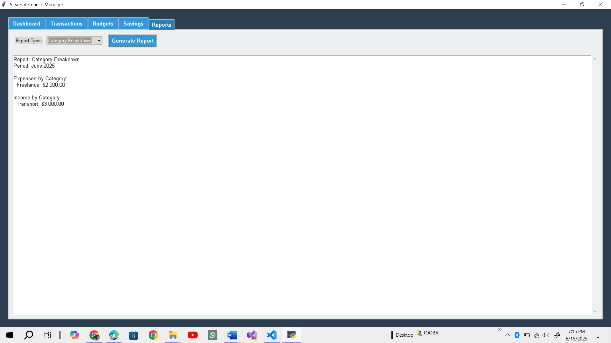

# PersonalFinanceManager

this is personal finance manager (Desktop Application) made in python.

you can run check_database.py file to see databse data or stored data in my applications databas.
